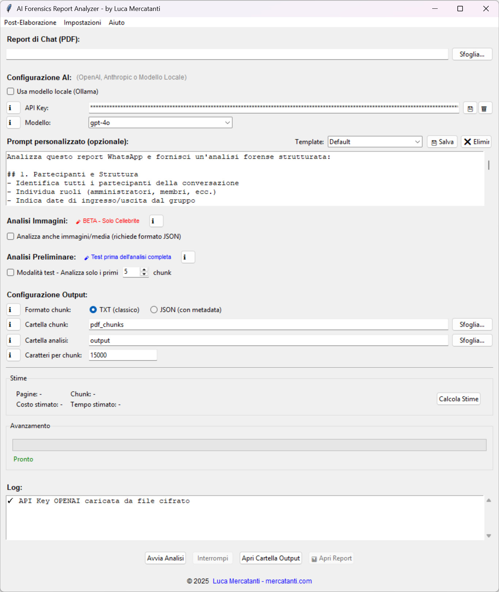
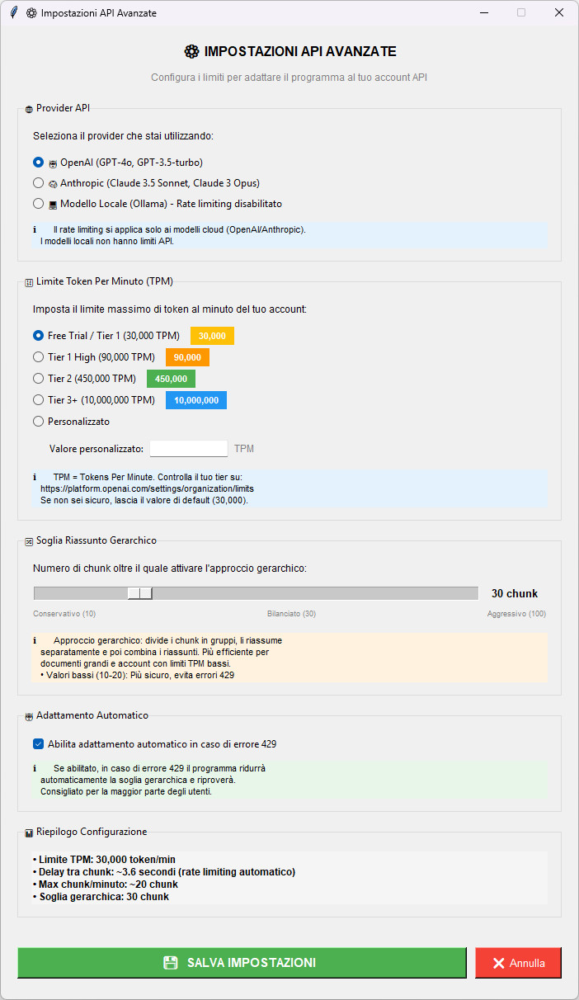
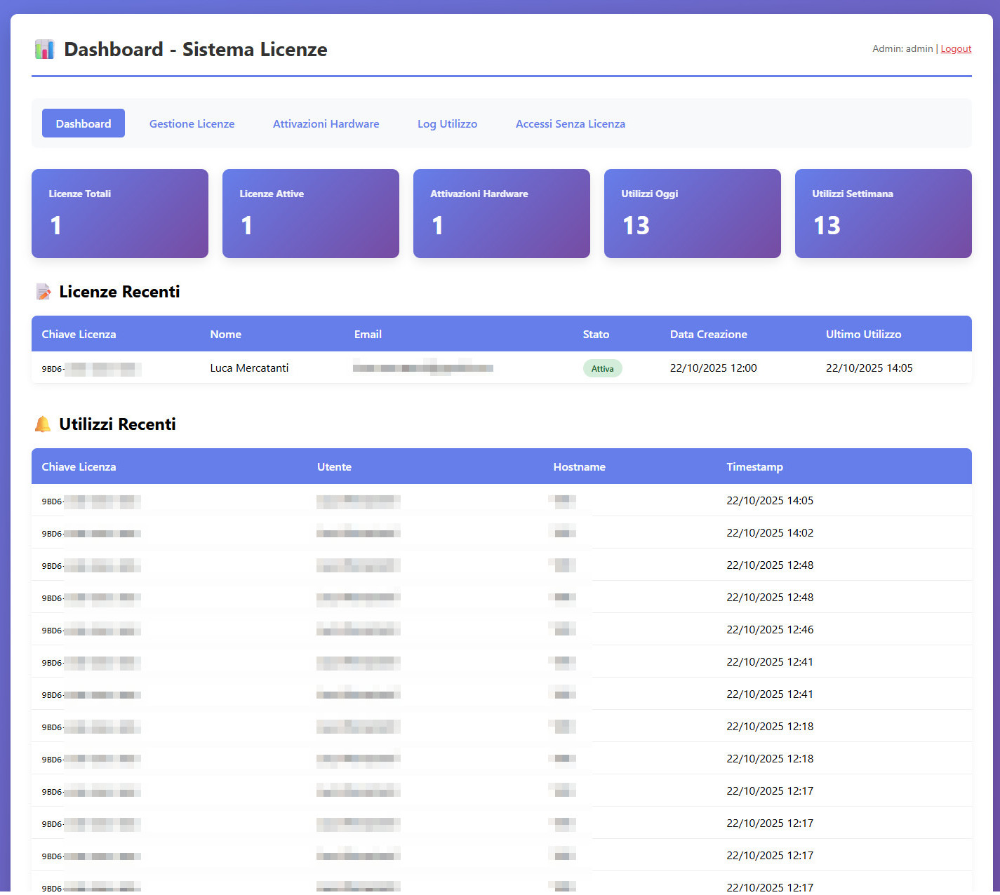

# 🧠 AI Forensic Report Analyzer (AFRA)


**AI Forensic Report Analyzer (AFRA)** è uno strumento di analisi forense basato su **Intelligenza Artificiale**, progettato per processare ed estrarre informazioni da report di chat e conversazioni esportati da strumenti forensi come **Cellebrite** e **Oxygen Forensics**.

Invece di leggere manualmente migliaia di pagine, **AFRA**:
- Segmenta automaticamente i documenti in chunk intelligenti  
- Analizza ogni sezione con modelli AI avanzati  
- Estrae informazioni chiave strutturate  
- Genera report HTML interattivi multi-pagina  
- Identifica conversazioni individuali e produce analisi dedicate  

---

## ✨ Funzionalità Principali

### 🤖 Analisi AI Multi-Provider
Supporta diversi motori di intelligenza artificiale:
- **OpenAI** → GPT-4o, GPT-4-turbo, GPT-3.5-turbo  
- **Anthropic** → Claude 3.5 Sonnet, Claude 3 Opus  
- **Ollama** → Modelli locali (Llama, Mistral, ecc.) → 💯 **Offline & Gratis**

### 🖼️ Analisi Immagini (Vision Models)
- Estrazione automatica dei percorsi immagine dai report Cellebrite  
- Supporto ai formati JPG, PNG, GIF, WEBP  
- Analisi multimodale testo + immagini  
- Compatibile con GPT-4o, Claude 3.5 Sonnet e LLaVA  

### 💬 Report per Chat
- Rilevamento automatico delle conversazioni individuali mediante AI
- Generazione di riassunti dedicati per ogni chat
- Distinzione automatica tra chat 1v1 e gruppi
- Output HTML strutturato e facilmente navigabile

### 🗺️ Analisi Posizioni Geografiche
- Estrazione automatica di **coordinate GPS**, **indirizzi** e **luoghi** menzionati
- Geocoding con **Nominatim** (gratuito) o **Google Maps API**
- Mappa interattiva con marker colorati per livello di confidence
- Filtro per soglia di confidenza (0-100%)
- Deduzione automatica posizioni dal contesto (opzionale)
- Report HTML con tabella sortable e mappa Leaflet.js

**Il tool analizza automaticamente:**

💬 Conversazioni e messaggi  
👥 Partecipanti e contatti  
📅 Date, orari e timeline  
📎 Media condivisi (solo immagini, *fase beta*)  
🔗 Link e riferimenti  
📍 Posizioni e indirizzi  
📞 Numeri di telefono  
🔍 Pattern sospetti di comunicazione (minacce, circonvenzione, ecc.)

---

## 🚀 Quick Start

### 1️⃣ Installazione
```bash
pip install -r requirements.txt
python verifica_installazione.py
```
Oppure, su Windows: doppio click su **install.bat**

### 2️⃣ Avvio
```bash
python whatsapp_analyzer_gui.py
```
Oppure, su Windows: doppio click su **avvia.bat**

---

## 🔍 Differenze tra “Ricerca Rapida” e “Re-Analisi Avanzata”

### ⚡ 1. Ricerca Rapida
**Fare domande veloci sui risultati già analizzati**

**Come funziona:**
1. Carica tutte le analisi esistenti (es. `analisi_chunk_001.txt`, `analisi_chunk_002.txt`, …)  
2. Invia le analisi e la tua domanda al modello AI  
3. L’AI cerca nei risultati già elaborati  
4. Non riprocessa i chunk originali  

**Esempi d’uso:**
- «Chi ha minacciato qualcuno?»  
- «Elenca tutti i luoghi menzionati»  
- «Trova riferimenti a denaro o pagamenti»  
- «Quali allegati sono stati condivisi?»  

**Limiti:**  
Non riprocessa i dati grezzi. Se l’analisi iniziale non ha rilevato qualcosa, non lo troverà.

---

### 🔁 2. Re-Analisi Avanzata
**Riprocessare i chunk originali con un nuovo prompt focalizzato su aspetti specifici**

**Come funziona:**
1. Filtra i chunk originali per parole chiave (es. “minaccia”, “violenza”)  
2. Rilegge i chunk originali (non le analisi già fatte)  
3. Rianalizza ogni chunk con un nuovo prompt  
4. Crea una nuova cartella `reanalisi_YYYYMMDD_HHMMSS/` con:  
   - Nuove analisi dettagliate  
   - Nuovo riassunto finale  
   - Nuovo report HTML  

**Esempi d’uso:**
- «Analizza solo le minacce, con categorizzazione dettagliata»  
- «Rianalizza i chunk che parlano di denaro, focalizzandoti su importi e transazioni»  
- «Cerca riferimenti a sostanze illegali con contesto completo»  
- «Approfondisci i messaggi violenti con scala di gravità»

**Vantaggi:**  
Analisi più profonda e mirata, senza sovrascrivere i risultati originali.

---

### 🧩 In Sintesi
| Tipo di Analisi | Fonte Dati | Quando Usarla |
|------------------|-------------|----------------|
| 🔍 **Ricerca Rapida** | Analisi già effettuate | Per cercare o interrogare risultati precedenti |
| 🔁 **Re-Analisi Avanzata** | Dati grezzi originali | Per nuove analisi focalizzate o correttive |

---

## 🗺️ Analisi Posizioni Geografiche

**Estrai e visualizza automaticamente tutte le posizioni menzionate nelle conversazioni**

### Come funziona:
1. L'AI identifica **coordinate GPS**, **indirizzi** e **luoghi** nei messaggi
2. Le posizioni vengono geocodificate (convertite in coordinate)
3. Viene generata una **mappa interattiva** con marker colorati
4. Ogni posizione è collegata al chunk originale per verifica

### 🎯 Opzioni disponibili:

**Provider Geocoding:**
- **Nominatim (OpenStreetMap)** → Gratuito, delay 1.5 sec tra richieste
- **Google Maps API** → API key richiesta, più preciso, delay 0.5 sec

**Filtro Confidence:**
- **Alta (70-100%)** → Coordinate GPS precise, indirizzi completi
- **Media (40-69%)** → Luoghi generici (es. "Stazione Centrale Milano")
- **Bassa (0-39%)** → Possibili falsi positivi

**Deduzione Contesto (opzionale):**
Quando attivo, l'AI cerca anche posizioni **implicite** come:
- "Ci vediamo al solito posto" → (deduce da messaggi precedenti)
- "Sono tornato a casa" → (deduce indirizzo da contesto)

### 📊 Output generato:
- **Mappa interattiva Leaflet.js** con marker colorati
- **Tabella sortable** con tutte le posizioni trovate
- **Link diretti** ai chunk originali per ogni menzione
- **File JSON** con tutti i dati per elaborazioni successive

---

## 🔧 Configurazioni

### API Key (scegli un provider)

**🔹 OpenAI**
1. [Crea una chiave su OpenAI](https://platform.openai.com/api-keys)  
2. Usa modelli: `gpt-4o`, `gpt-4-turbo`, `gpt-3.5-turbo`

**🔹 Anthropic**
1. [Crea una chiave su Anthropic](https://console.anthropic.com/)  
2. Usa modelli: `claude-3-5-sonnet`, `claude-3-opus`

⚠️ Assicurati che la chiave API corrisponda al provider del modello selezionato.

---

## ⚙️ Impostazioni API Avanzate


### Perché servono
I provider AI (OpenAI, Anthropic) impongono limiti di richieste al minuto (**TPM – Tokens Per Minute**).  
Superarli causa errori **429 (Rate Limit Exceeded)** che interrompono l’analisi.

Con le impostazioni API attive, **AFRA** regola automaticamente il flusso delle richieste, evitando blocchi e perdite di dati.

### Funzionamento
AFRA calcola i **delay ottimali** tra le chiamate API in base a:
- Provider (OpenAI, Anthropic, Ollama)
- Tier dell’account (Free, Tier 1, Tier 2…)
- Limite TPM del modello
- Dimensione dei chunk da analizzare

| Provider | Tier | Limite TPM | Delay Medio | Chunk/Ora |
|-----------|------|-------------|--------------|------------|
| OpenAI | Tier 1 | 30k | ~3.6s | ~1.000 |
| OpenAI | Tier 2 | 450k | ~0.2s | ~18.000 |
| Anthropic | Tier 1 | 40k | ~2.7s | ~1.300 |
| Ollama | Locale | ∞ | 0s | Illimitato |

### 🔧 Configurazione
**Percorso:** Menu → Impostazioni → ⚙️ Impostazioni API  

Imposta:
- **Provider e Tier** per il calcolo automatico dei limiti  
- **Soglia gerarchica** (chunk max per analisi)  
- **Adattamento automatico**, per correggere eventuali errori 429

---

## 🧠 Prompt Predefinito (Ottimizzato per Analisi Forense WhatsApp)

Il prompt integrato è strutturato in **8 sezioni di analisi**, pensate per indagini forensi:

1. **Partecipanti e Struttura** — ruoli, amministratori, membri  
2. **Timeline e Cronologia** — eventi con timestamp precisi  
3. **Contenuti e Messaggi** — messaggi, media, link  
4. **Posizioni e Spostamenti** ⭐ — luoghi, indirizzi, viaggi  
5. **Minacce e Contenuti Problematici** ⚠️ — offese, aggressioni, circonvenzioni  
6. **Informazioni Sensibili** — numeri di telefono, email, dati personali  
7. **Pattern di Comunicazione** — temi ricorrenti, tono, relazioni  
8. **Note Forensi** — anomalie, messaggi eliminati, incongruenze

---

## 📜 Gestione licenze ed uso



Il tool presenta inoltre la possibilità di tracciare l'utilizzo del software e distribuire licenze.
Per utilizzare questa funzione è necessario caricare il sistema API all'interno in un hosting con supportp PHP + MySql

### 1️⃣ Installazione sistema licenze 
```bash
Crea un database MySql
Importa il file "database.sql" utilizzando PhpMyAdmin
Inserisci i dati del database nel file "config.php"
```
